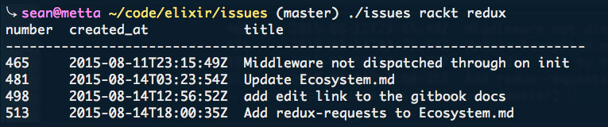

GitHub Issues CLI
=================

GitHub Issues CLI in Elixir, from [Programming Elixir](https://pragprog.com/book/elixir/programming-elixir). Excellent book.

`usage: issues <user> <project> [ count | 4 ]`

---
[Sean Omlor](http://seanomlor.com)
